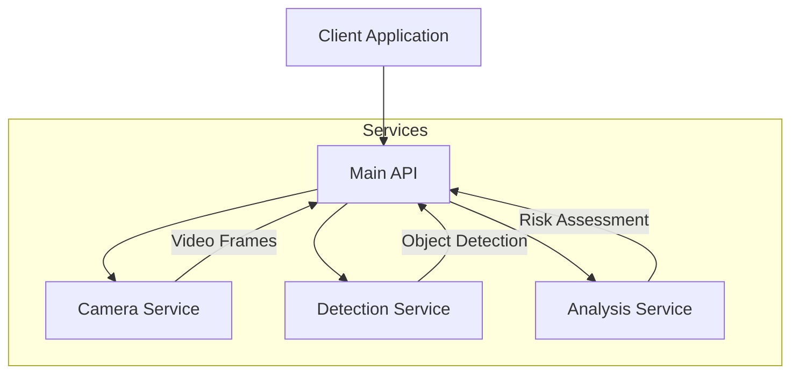

# live-accident-prediction
Predict accidents based on video data

## Current Implementation
Currently, the system runs as a monolithic Python application that:
- Processes video input directly using OpenCV
- Performs object detection using YOLO
- Analyzes scenes using GPT-4 Vision
- Visualizes results in real-time

## Future Architecture
The system will be split into microservices with a main API written in Go:



### Services Description:

1. **Main API (Golang)**
   - Coordinates communication between services
   - Handles client connections
   - Streams processed results
   - Manages system state

2. **Camera Service (FastAPI)**
   - Handles video input streams
   - Processes frames using OpenCV
   - Provides frame data to main API
   - Supports multiple camera sources

3. **Detection Service (FastAPI)**
   - Runs YOLO object detection
   - Tracks objects across frames
   - Provides detection results
   - Manages detection models

4. **Analysis Service (FastAPI)**
   - Performs scene analysis using GPT-4 Vision
   - Calculates risk assessments
   - Provides detailed analysis results
   - Handles ML model inference

## Usage

```bash
python accident_predictor_iid_cars.py
```

## TODO:
- Given accident status, prompt model with bounding boxes to identify objects involved in the accident and their characteristics. If possible, read vehicle identification numbers.
- Convert to API architecture where:
  - Video comes from a camera service
  - Detections come from a detection service (separate API)
  - Analysis comes from an analysis service (separate API)
  - Results are returned to a result service written in golang
